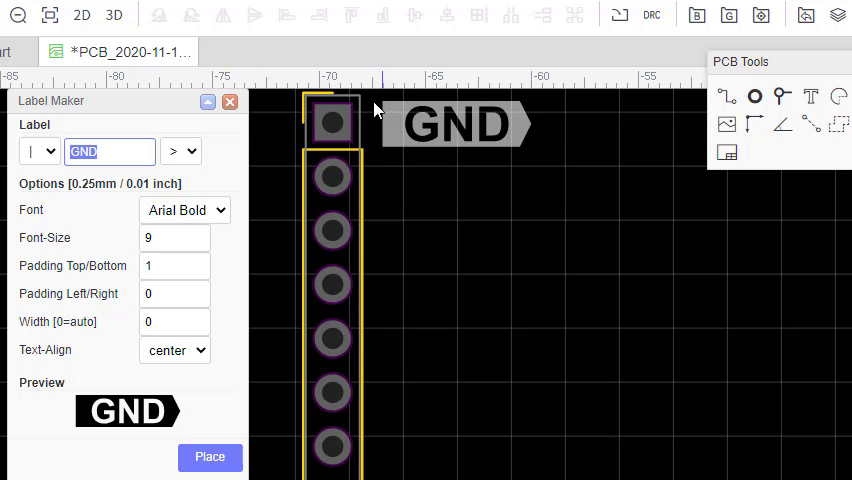
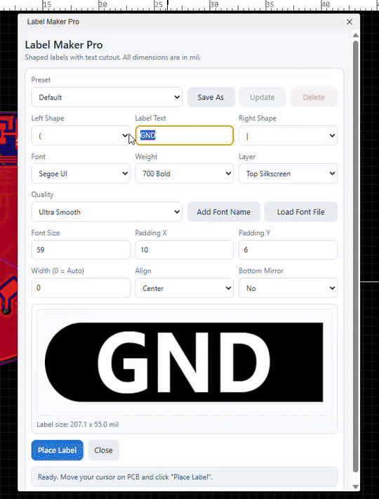

# Label Maker Pro for EasyEDA Pro

EasyEDA Pro extension for creating shaped silkscreen labels with text cutout.




## Features

- Shaped labels with left/right caps: `(` `)` `<` `>` `/` `\` `|` `[` `]`
- Live preview before placement
- Ultra/Balanced/Fast quality profiles
- Font family + font weight control
- `Place Label` floating placement mode
- `Esc` to cancel placement and return to settings
- Presets (save/update/delete)
- Top/Bottom silkscreen support with mirror option
- Dimensions in `mil`

## Install In EasyEDA Pro

1. Open EasyEDA Pro.
2. Open Extension Manager.
3. Install from local file:
   - `build/dist/eext-labelmaker-pro_v1.0.0.eext`
   - or `build/dist/eext-labelmaker-pro_v1.0.0.zip`
4. In PCB editor open: `Label Maker -> Open Label Maker...`

## How To Use

1. Set text, shape, font, size, padding, width and alignment.
2. Click `Place Label`.
3. Label Maker window hides and label follows your cursor.
4. Click once on PCB to place label.
5. Press `Esc` to cancel placement and return to the settings window.

## Build From Source

```bash
npm install
npm run build
```

Generated packages:

- `build/dist/eext-labelmaker-pro_v1.0.0.eext`
- `build/dist/eext-labelmaker-pro_v1.0.0.zip`

## Prepare GitHub Publication

1. Create new GitHub repository: `easyeda-pro-labelmaker-pro`.
2. Copy this folder content to that repository root.
3. Push to GitHub:

```bash
git init
git add .
git commit -m "Initial release: Label Maker Pro for EasyEDA Pro"
git branch -M main
git remote add origin https://github.com/grzegorzwozny/easyeda-pro-labelmaker-pro.git
git push -u origin main
```

## Update Demo Media

If you want to regenerate media from your own recording:

```powershell
powershell -ExecutionPolicy Bypass -File docs/make-demo-assets.ps1 -InputMp4 "c:\path\to\your\recording.mp4"
```

The script updates:

- `docs/image.png`
- `docs/demo.gif`
